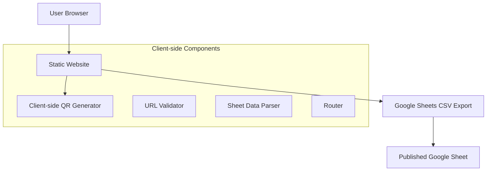

# Design Document

## Overview

The QR code generator and URL shortener is a static web application that provides two main functionalities: generating QR codes for URLs and redirecting shortened URLs to their original destinations. The system uses Google Sheets as a publicly accessible data source, eliminating the need for backend servers or API authentication.

The application follows a client-side architecture where JavaScript directly fetches data from a published Google Sheet and generates QR codes in the browser. This approach enables deployment as a static site on platforms like GitHub Pages, Netlify, or Vercel.

## Architecture

### High-Level Architecture



### Technology Stack

- **Frontend**: Vanilla HTML/CSS/JavaScript (no build process required)
- **Google Sheets Integration**: Fetch data via CSV export URL from published Google Sheet
- **QR Code Generation**: QRCode.js library for client-side QR code generation
- **Routing**: Client-side routing using JavaScript for handling /{id} paths
- **Deployment**: Static hosting (GitHub Pages, Netlify, Vercel, etc.)

## Components and Interfaces

### 1. Static Website Component

**Responsibilities:**
- Serve HTML pages for QR generation and URL redirection
- Handle client-side routing for /{id} paths
- Coordinate between other client-side components
- Display appropriate UI states and error messages

**Key Pages:**
- `/` (index.html) - QR code generation form and display
- `/{id}` - JavaScript-handled redirect logic

### 2. Google Sheets Data Service

**Responsibilities:**
- Fetch data from published Google Sheets CSV export
- Parse CSV data into usable JavaScript objects
- Cache data to minimize requests
- Handle fetch errors and network issues

**Interface:**
```javascript
class SheetsDataService {
  async fetchSheetData()
  async findUrlById(id)
  parseCSVData(csvText)
}
```

**Data Access Method:**
- Google Sheets published as CSV via URL: `https://docs.google.com/spreadsheets/d/1WPO2Hs53oFtPExN3kZLFfJtsRclE1ZA3uat59elqXwg/export?format=csv`
- Data Schema:
  - Column A: `id` (string) - Unique identifier for the shortened URL
  - Column B: `to` (string) - Original URL destination  
  - Column C: `description` (string) - Optional description

**Note:** This approach requires the Google Sheet to be published publicly. New URLs must be manually added to the sheet or through Google Forms integration.

### 3. Client-side QR Code Generator

**Responsibilities:**
- Generate QR codes from URLs using browser JavaScript
- Display QR codes as canvas or SVG elements
- Handle QR code generation errors

**Interface:**
```javascript
class QRCodeGenerator {
  generateQR(url, containerId, options)
  clearQR(containerId)
}
```

### 4. URL Validator

**Responsibilities:**
- Validate URL format on the client side
- Ensure URLs are properly formatted with protocol
- Provide user feedback for invalid URLs

**Interface:**
```javascript
class URLValidator {
  isValidUrl(url)
  normalizeUrl(url)
  getValidationMessage(url)
}
```

### 5. Client-side Router

**Responsibilities:**
- Handle /{id} path routing in the browser
- Perform redirects based on sheet data
- Show 404 page for invalid IDs

**Interface:**
```javascript
class Router {
  handleRoute()
  redirect(url)
  show404()
}
```

## Data Models

### URL Record
```javascript
{
  id: string,        // Unique identifier (6-8 characters)
  to: string,        // Original URL with protocol
  description: string, // Optional description
  createdAt: Date    // Timestamp (stored as string in sheets)
}
```

### QR Code Response
```javascript
{
  qrCodeDataUrl: string,  // Base64 encoded QR code image
  shortUrl: string,       // Complete shortened URL
  originalUrl: string,    // Original URL
  id: string             // Generated ID
}
```

## Error Handling

### Error Types and Responses

1. **Invalid URL Format**
   - HTTP 400 Bad Request
   - User-friendly message: "Please enter a valid URL starting with http:// or https://"

2. **Google Sheets Fetch Errors**
   - Network error or CORS issues
   - User-friendly message: "Unable to load data. Please check your connection and try again."

3. **URL Not Found (Invalid ID)**
   - HTTP 404 Not Found
   - Display custom 404 page with option to create new short URL

4. **QR Code Generation Failure**
   - HTTP 500 Internal Server Error
   - User-friendly message: "Failed to generate QR code. Please try again."

5. **Rate Limiting**
   - HTTP 429 Too Many Requests
   - User-friendly message: "Too many requests. Please wait a moment and try again."

### Error Handling Strategy

- All errors are logged with appropriate detail for debugging
- User-facing errors provide helpful, non-technical messages
- Fallback mechanisms for non-critical failures
- Graceful degradation when external services are unavailable

## Testing Strategy

### Unit Tests
- URL validation logic
- ID generation uniqueness
- QR code generation with various inputs
- Google Sheets service methods (with mocked API)

### Integration Tests
- End-to-end QR code generation flow
- QR code generation and display
- Redirect functionality
- Google Sheets CSV fetch and parsing (with test spreadsheet)

### Manual Testing Scenarios
- Submit various URL formats (with/without protocol, international domains)
- Test QR code scanning with mobile devices
- Verify redirects work correctly
- Test error scenarios (invalid IDs, malformed URLs)
- Performance testing with multiple concurrent requests

### Test Data Management
- Use separate test Google Sheet for integration tests
- Mock CSV fetch responses for unit tests
- Test with various URL formats and edge cases
- Verify QR codes are scannable across different QR readers

### Deployment Considerations
- Ensure Google Sheet is published publicly with "Anyone with the link can view" permissions
- Configure static hosting to serve index.html for all routes (for client-side routing)
- Set up proper CORS headers if needed for Google Sheets access
- Consider caching strategies for sheet data to improve performance